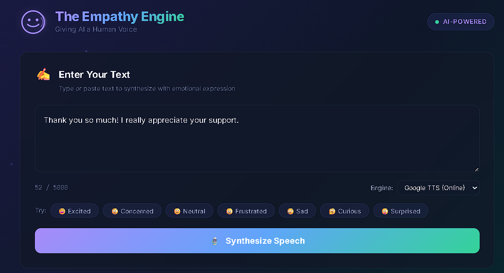
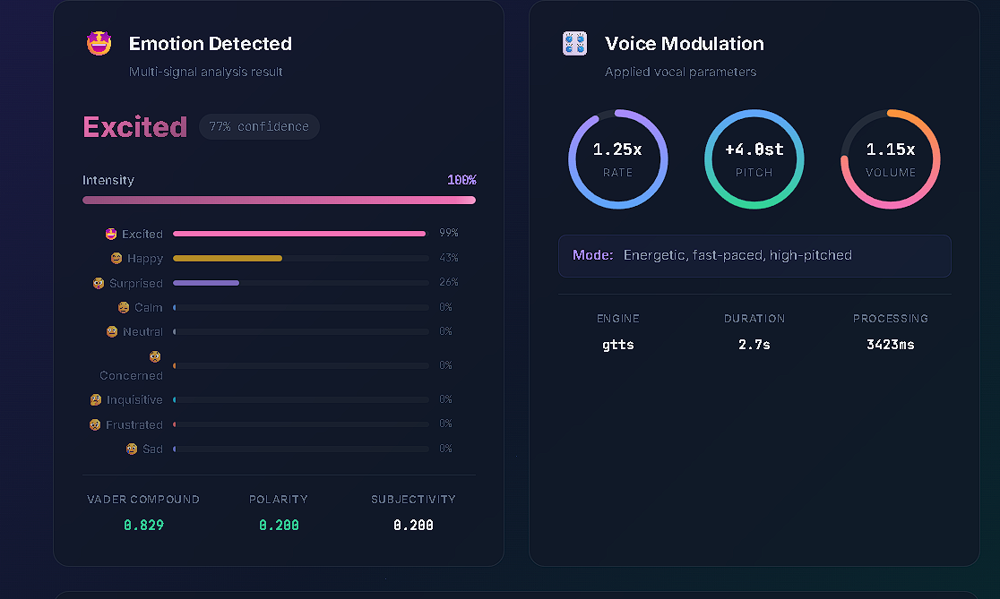
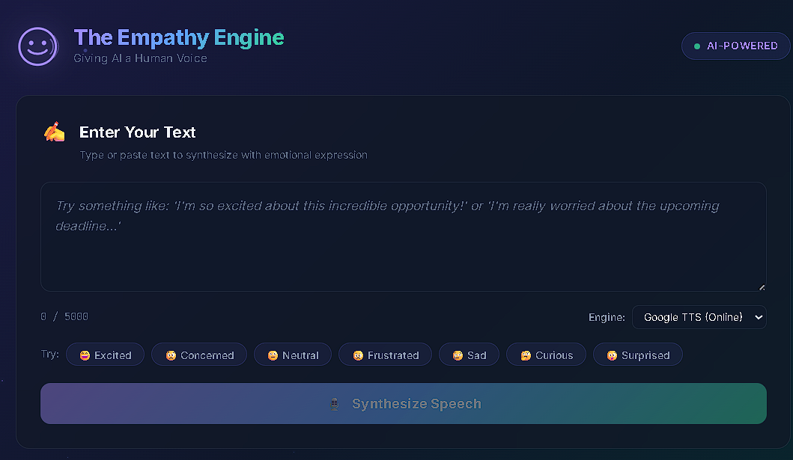
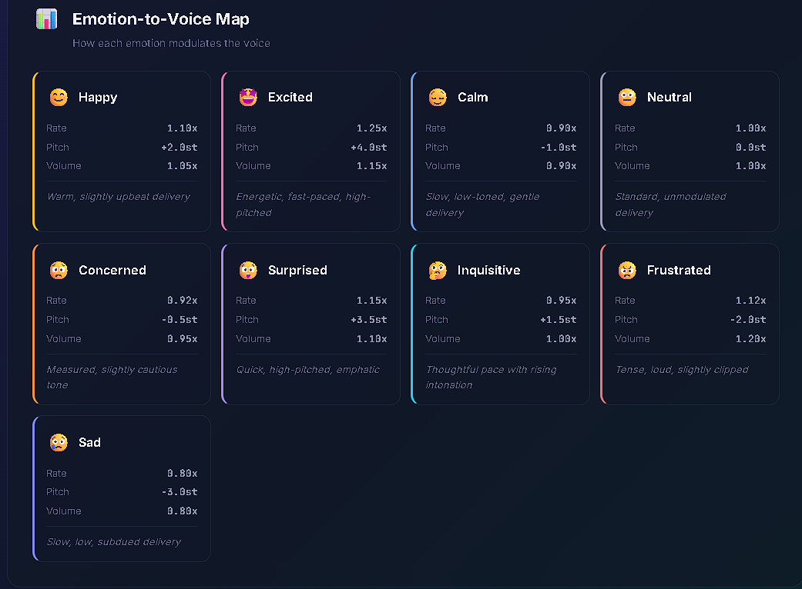

# 🎙️ The Empathy Engine — Giving AI a Human Voice

> An AI-powered service that dynamically modulates the vocal characteristics of synthesized speech based on the detected emotion of the source text. Moving beyond monotonic delivery to achieve emotional resonance.


---

## 📋 Table of Contents

- [Overview](#-overview)
- [Features](#-features)
- [Architecture](#-architecture)
- [Design Choices](#-design-choices)
- [Setup & Installation](#-setup--installation)
- [Running the Application](#-running-the-application)
- [API Reference](#-api-reference)
- [Emotion-to-Voice Mapping](#-emotion-to-voice-mapping)
- [Tech Stack](#-tech-stack)

---

## 🌟 Overview

The Empathy Engine bridges the gap between text-based sentiment and expressive, human-like audio output. It analyzes input text to detect emotional context, then dynamically adjusts speech synthesis parameters to create voice output that sounds genuinely enthusiastic about good news, patient and calm when someone is frustrated, or concerned when the content is worrisome.

---

## ✨ Features

### Core Features
- **🔍 Multi-Signal Emotion Detection**: Combines VADER sentiment analysis, TextBlob polarity/subjectivity, and keyword-based analysis for accurate classification
- **🎛️ Three-Parameter Voice Modulation**: Programmatically adjusts **Rate**, **Pitch**, and **Volume** based on detected emotion
- **📊 9 Granular Emotions**: Detects `happy`, `excited`, `calm`, `neutral`, `concerned`, `surprised`, `inquisitive`, `frustrated`, and `sad`
- **📈 Intensity Scaling**: Vocal modulation scales proportionally with emotion intensity — "This is good" gets subtle changes while "This is the BEST NEWS EVER!" gets dramatic shifts
- **🔊 WAV Audio Output**: Generates high-quality playable audio files

### Bonus Features
- **🌐 Web Interface**: Beautiful, responsive web UI with real-time visualization
- **🎯 SSML-like Processing**: Automatic pause insertion and emphasis based on emotional context
- **📊 Live Visualization**: SVG dial gauges for voice parameters, emotion distribution bars, and waveform animation
- **🔄 Dual TTS Engines**: Choose between Google TTS (online, higher quality) or pyttsx3 (offline, no internet required)
- **⬇️ Audio Download**: Download generated audio files directly from the browser
- **⌨️ Keyboard Shortcuts**: Ctrl+Enter to synthesize

---

## 🏗️ Architecture

```
┌─────────────────────────────────────────────────┐
│                  Web Interface                   │
│          (HTML/CSS/JS - Static Files)            │
└───────────────────┬─────────────────────────────┘
                    │ HTTP API
┌───────────────────▼─────────────────────────────┐
│              FastAPI Backend (main.py)            │
│                                                   │
│  ┌──────────────────┐   ┌──────────────────────┐ │
│  │ Emotion Analyzer │   │   Voice Modulator    │ │
│  │                  │   │                      │ │
│  │ • VADER          │──▶│ • Rate Multiplier    │ │
│  │ • TextBlob       │   │ • Pitch Shift        │ │
│  │ • Keyword Match  │   │ • Volume Control     │ │
│  │ • Intensity Calc │   │ • SSML Processing    │ │
│  └──────────────────┘   │ • gTTS / pyttsx3     │ │
│                          └──────────┬───────────┘ │
└─────────────────────────────────────┬─────────────┘
                                      │
                              ┌───────▼───────┐
                              │  Audio Output  │
                              │   (.wav file)  │
                              └───────────────┘
```

---

## 🎨 Design Choices

### Emotion Detection Strategy

We use a **multi-signal fusion approach** rather than a single model:

1. **VADER Sentiment**: Provides compound sentiment score (-1 to +1) optimized for social media text
2. **TextBlob**: Adds polarity and subjectivity dimensions
3. **Keyword Analysis**: Domain-specific keyword sets for each emotion add precision
4. **Contextual Signals**: Exclamation marks boost excitement/frustration, question marks boost inquisitiveness, ALL CAPS boost intensity

The confidence score reflects agreement between these independent signals.

### Voice Modulation Logic

Each emotion defines **base multipliers** for three vocal parameters:

| Parameter | What it Controls | Emotional Rationale |
|-----------|-----------------|---------------------|
| **Rate** | Speaking speed (0.8x - 1.25x) | Excited people speak faster; sad people slower |
| **Pitch** | Tonal height (-3 to +4 semitones) | Happy/surprised = higher pitch; sad/frustrated = lower |
| **Volume** | Amplitude (0.8x - 1.2x) | Frustrated/excited = louder; calm/sad = softer |

### Intensity Scaling

Parameters don't jump to full emotion values. Instead, they **scale linearly with intensity**:

```
final_param = neutral + (emotion_param - neutral) × intensity
```

This means "I'm happy" (intensity 0.4) gets subtle modulation, while "I'M SO INCREDIBLY HAPPY!!!" (intensity 0.9) gets dramatic changes.

---

## 🚀 Setup & Installation

### Prerequisites
- **Python 3.9+** installed
- **pip** package manager
- **ffmpeg** installed and in PATH (required by pydub for audio processing)
  - Windows: `winget install ffmpeg` or download from [ffmpeg.org](https://ffmpeg.org/download.html)
  - macOS: `brew install ffmpeg`
  - Linux: `sudo apt install ffmpeg`

### Step-by-Step Installation

1. **Clone the repository**
   ```bash
   git clone <repository-url>
   cd voiceproject
   ```

2. **Create a virtual environment** (recommended)
   ```bash
   python -m venv venv
   
   # Windows
   venv\Scripts\activate
   
   # macOS/Linux
   source venv/bin/activate
   ```

3. **Install dependencies**
   ```bash
   pip install -r requirements.txt
   ```

4. **Download NLTK data** (required by TextBlob)
   ```bash
   python -c "import nltk; nltk.download('punkt_tab')"
   ```

---

## ▶️ Running the Application

### Web Interface (Recommended)

```bash
python main.py
```

Then open your browser to **http://localhost:8000**

### API Documentation

FastAPI auto-generates interactive docs at **http://localhost:8000/docs**

### Quick API Test (curl)

```bash
# Analyze emotion only
curl -X POST http://localhost:8000/api/analyze \
  -H "Content-Type: application/json" \
  -d '{"text": "I am so excited about this!"}'

# Full synthesis
curl -X POST http://localhost:8000/api/synthesize \
  -H "Content-Type: application/json" \
  -d '{"text": "This is wonderful news!", "engine": "gtts"}'
```

---

## 📡 API Reference

### `POST /api/analyze`
Analyze text emotion without generating audio.

**Request Body:**
```json
{
  "text": "Your text here"
}
```

**Response:**
```json
{
  "success": true,
  "text": "Your text here",
  "emotion_analysis": {
    "emotion": "happy",
    "intensity": 0.65,
    "confidence": 0.82,
    "vader_scores": { "neg": 0, "neu": 0.4, "pos": 0.6, "compound": 0.75 },
    "textblob_scores": { "polarity": 0.6, "subjectivity": 0.8 },
    "all_emotions": { "happy": 0.9, "excited": 0.5, ... }
  }
}
```

### `POST /api/synthesize`
Full pipeline: analyze → modulate → synthesize → serve audio.

**Request Body:**
```json
{
  "text": "Your text here",
  "engine": "gtts",
  "override_emotion": null,
  "override_intensity": null
}
```

### `GET /api/audio/{filename}`
Retrieve a generated audio file.

### `GET /api/emotions`
Get the complete emotion-to-voice parameter mapping.

### `GET /api/health`
Service health check.

---

## 🗺️ Emotion-to-Voice Mapping

| Emotion | Rate | Pitch | Volume | Description |
|---------|------|-------|--------|-------------|
| 😊 Happy | 1.10x | +2.0st | 1.05x | Warm, slightly upbeat delivery |
| 🤩 Excited | 1.25x | +4.0st | 1.15x | Energetic, fast-paced, high-pitched |
| 😌 Calm | 0.90x | -1.0st | 0.90x | Slow, low-toned, gentle delivery |
| 😐 Neutral | 1.00x | 0.0st | 1.00x | Standard, unmodulated delivery |
| 😟 Concerned | 0.92x | -0.5st | 0.95x | Measured, slightly cautious tone |
| 😲 Surprised | 1.15x | +3.5st | 1.10x | Quick, high-pitched, emphatic |
| 🤔 Inquisitive | 0.95x | +1.5st | 1.00x | Thoughtful pace with rising intonation |
| 😠 Frustrated | 1.12x | -2.0st | 1.20x | Tense, loud, slightly clipped |
| 😢 Sad | 0.80x | -3.0st | 0.80x | Slow, low, subdued delivery |

*st = semitones*

---

## 🛠️ Tech Stack

| Component | Technology | Purpose |
|-----------|-----------|---------|
| Backend | **FastAPI** | REST API framework with auto-docs |
| Emotion Analysis | **VADER** + **TextBlob** | Multi-signal sentiment/emotion detection |
| TTS (Online) | **gTTS** | Google Text-to-Speech synthesis |
| TTS (Offline) | **pyttsx3** | Local TTS engine |
| Audio Processing | **pydub** | Rate, pitch, volume modulation |
| Frontend | **Vanilla HTML/CSS/JS** | Responsive web interface |
| Typography | **Inter** + **JetBrains Mono** | Modern web fonts |

---

## 📁 Project Structure

```
voiceproject/
├── main.py                 # FastAPI server & API routes
├── emotion_analyzer.py     # Multi-signal emotion detection
├── voice_modulator.py      # TTS synthesis with vocal modulation
├── requirements.txt        # Python dependencies
├── README.md               # This file
├── .gitignore
├── static/
│   ├── index.html          # Web interface
│   ├── style.css           # Design system & styles
│   └── script.js           # Frontend interactivity
└── output/                 # Generated audio files (gitignored)
```

---
## 📸 Screenshots





## sample audio output
Exicited Emotion
[Listen](output/empathy_excited_100_33a1bfa7.wav)

## 📄 License

MIT License — feel free to use, modify, and distribute.
